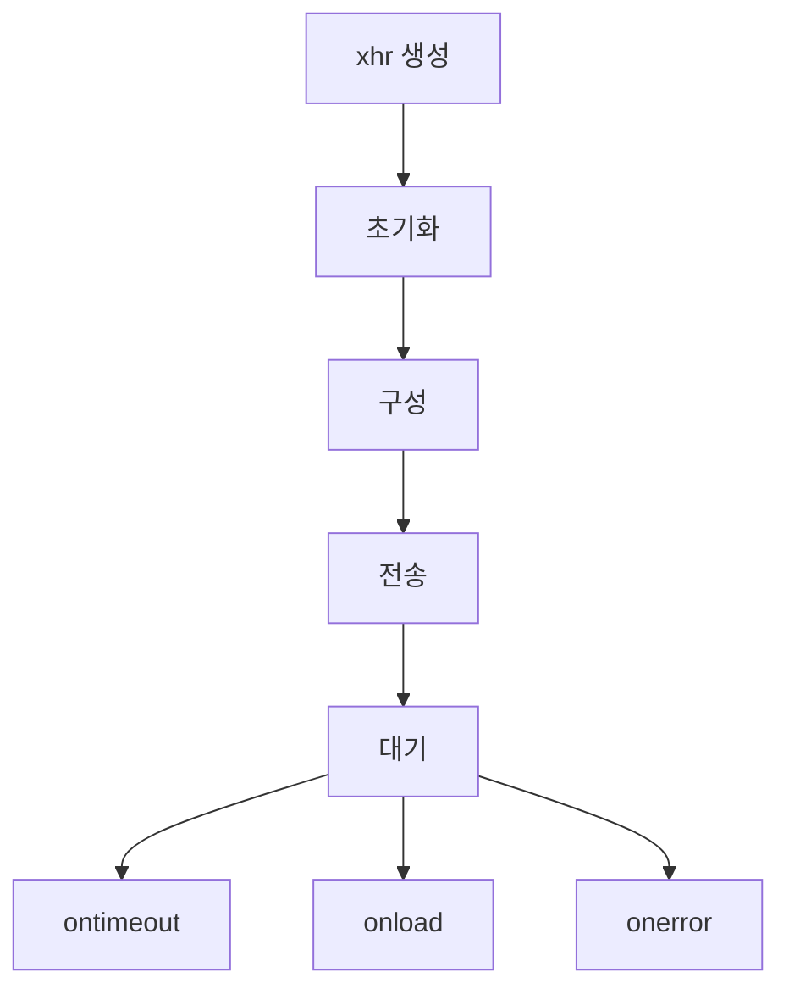
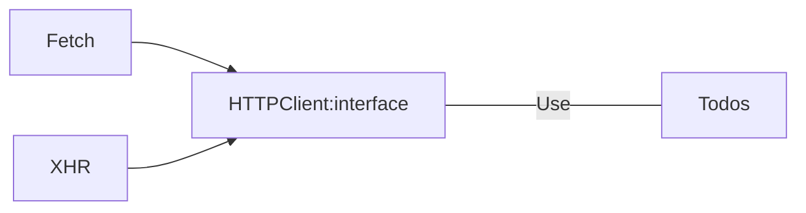

### 날짜  2024-02-16 19:05

### 태그:

>[!메모]
>

### 원문
---
# HTTP 요청 예제
- XMLHttpRequest, Fetch, axiosls
- 
## 기본 구조
### 간단한 html
```html
<html>

<body>
	<button data-list>Read Todos</button>
	<button data-add>Add Todos</button>
	<button data-update>Update Todos</button>
	<button data-delete>Delete Todos</button>
	<div></div>
</body>

</html>
```
### HTTP 클라이언트 애플리케이션 메인 컨트롤러
- [[0.0 해결해야 할 질문 by 프없프개#왜 HTTP 클라이언트라고 지칭하는지?|왜 HTTP 클라이언트인가?]]
```js
import todos from './todos.js'

const NEW_TODO_TEXT = 'A simple todo Element';

const printResult = (action, result) => {
	const time = (new Date()).toTimeString();
	const node = document.createElement("p");  
	node.textContent = `${action.toUpperCase()}: ${JSON.stringify(  
		result
	)} (${time})`;
	document.querySelctor("div").appendChild(node)
}

const onListClick = async () => {  
	const result = await todos.list();  
	printResult("list todos", result);  
};  
  
const onUpdateClick = async () => {  
	const list = await todos.list();  
	const { id } = list[0];  
	const newTodo = {  
		id,  
		completed: true,  
	};  
	const result = await todos.update(newTodo);  
	printResult("update todo", result);  
};

const onDeleteClick = async () => {  
	const list = await todos.list();  
	const { id } = list[0];  
	
	const result = await todos.delete(id);  
	printResult("delete todo", result);  
};
  
document  
	.querySelector("button[data-list]")  
	.addEventListener("click", onListClick);  

document  
	.querySelector("button[data-add]")  
	.addEventListener("click", onAddClick);  
  
document  
	.querySelector("button[data-update]")  
	.addEventListener("click", onUpdateClick);  
  
document  
	.querySelector("button[data-delete]")  
	.addEventListener("click", onDeleteClick);
```
- HTTP 클라이언트를 직접 사용하는 대신 HTTP 요청을 todos 모델 객체에 래핑했다.
	- 테스트 가능성
		- todo 객체를 정적 데이터 세트(**fixture**)를 반환하는 목mock으로 바꿀 수 있다.
		- 컨트롤러를 독립적으로 테스트할 수 있다.
	- 가독성
		- 모델 객체는 코드를 더 명확하게 한다.
> 컨트롤러에서 HTTP 클라이언트를 직접 사용하지 않는다. 이런 함수는 모델 객체에서 캡슐화하는 것이 좋다.
### todo 모델 객체
```js
import http from './http.js'

const HEADERS = {
	'Content-Type': 'application/json'
}

const BASE_URL = '/api/todos'

const list = () => http.get(BASE_URL)

const create = text => {
	const todo = {
		text,
		completed: false
	}
	return http.post(
		BASE_URL,
		todo,
		HEADERS
	)
}

const update = newTodo => {
	const url = `${BASE_URL}/${newTodo.id}`
	return http.patch(
		url,
		newTodo,
		HEADERS
	)
}

const deleteTodo = id => {
	const url = `${BASE_URL}/${id}`
	return http.delete(
		url,
		HEADERS
	)
}

export default {
	list,
	create,
	update,
	delete: deleteTodo
}
```
- [[HTTP 클라이언트의 서명]]은 GET이나 DELETE 같이 본문이 필요 없는 메서드의 경우
	- http\[verb](url, config)
- 나머지 메서드
	- http\[verb](url, body, config)
- HTTP클라이언트에 반드시 공개 API를 사용해야 하는 것은 아니다.
	- 하지만 어떤 방법이든 일관성을 유지하는 것이 좋다.
## XMLHttpRequest
- W3C가 비동기 HTTP 요청의 표준 방법을 정의한 첫 번째 시도였다.
```js
const setHeaders = (xhr, headers) => {
	Object.entries(headers).forEach(entry => {
		const [name, value] = entry;

		xhr.setRequestHeader(name, value)
	});
};

const parseResponse = xhr => {
	const { status, responseText } = xhr;

	let data
	if (status !== 204) {
		data = JSON.parse(responseText);
	}

	return {
		status,
		data
	}
}

const request = params = {
	return new Promise((resolve, reject) => {
		const xhr = new XMLHttpRequest();

		const {
			method = 'GET',
			url,
			headers = {},
			body
		} = params;

		xhr.open(method, url);

		setHeaders(xhr, headers);

		xhr.send(JSON.stringify(body));

		xhr.onerror = () => {
			reject(new Error('HTTP Error'));
		}
		xhr.ontimeout = () => {
			reject(new Error('Timeout Error'));
		}
			xhr.onload = () => resovle(parseResponse(xhr));
	})
}

const get = async (url, headers) => {
	const response = await request({
		url,
		headers,
		method: 'GET'
	});

	return response.data;
}

const post = async (url, body, headers) => {
	const response = await request({
		url,
		headers,
		method: 'POST',
		body
	});

	return response.data;
}

const patch = async (url, body, headers) => {
	const response = await request({
		url,
		headers,
		method: 'PATCH',
		body
	});

	return response.data;
}

const deleteRequest = async (url, headers) => {
	const response = await request({
		url,
		headers,
		method: 'DELETE'
	});

	return response.data;
}

export default {
	get,
	post,
	put,
	patch,
	delete, deleteRequest
}
```
- HTTP 클라이언트의 핵심
	- request 메서드
- XMLHttpRequest는 **콜백**을 기반으로 한다.
	- 완료된 요청에 대한 **onload**
	- 오류로 끝나는 HTTP에 대한 **onerror**
	- 타임아웃된 요청에 대한 **ontimeout**
- HTTP 클라이언트의 공개 API는 **프라미스**를 기반으로 한다.
	- request 메서드는 표준 XMLHttpRequest 요청을 새로운 Promise 개체로 묶는다.
### XMLHttpRequest의 요청 흐름
```
1. 새로운 xhr 객체 생성
	new XMLHttpRequest()
2. 특정 URL로 요청 초기화
	xhr.open(method, url)
3. 요청 구성
	header, timeout 설정
4. 요청 전송
	xhr.send(JSON.stringify(body))
5. 요청이 끝날 때까지 대기
	- onload: 성공적
	- onerror: 에러
	- ontimeout: 타임아웃
```

## Fetch
- 원격 리소스에 접근하기 위해 만들어진 새로운 API.
	- Request, response 같은 많은 네트워크 객체에 대한 표준 정의를 제공하는 것이 목적이다.
	- Service Worker 또는 Cache 등 다른 API와 상호운용 할 수 있다.
- 요청을 생성하려면 Fetch API로 작성된 HTTP 클라이언트 구현인 window.fetch 메서드를 사용해야 한다.
```js
const parseResponse = async (response) => {
	const { status } = response;
	let data;
	if (staus !== 204) {
		data = await response.json();
	}

	return {
		status,
		data,
	};
};

const request = async (params) => {
	const { method = "GET", url, headers = {}, body } = params;

	const config = {
		method,
		headers: new window.Headers(headers),
	};

	if (body) {
		config.body = JSON.stringify(body);
	}

	const response = await window.fetch(url, config);

	return parseResponse(response);
};

const get = async (url, headers) => {
	const response = await request({
		url,
		headers,
		method: "GET",
	});

	return response.data;
};

const post = async (url, body, headers) => {
	const response = await request({
		url,
		headers,
		method: "POST",
		body,
	});

	return response.data;
};

const put = async (url, body, headers) => {
	const response = await request({
		url,
		headers,
		method: "PUT",
		body,
	});

	return response.data;
};

const patch = async (url, body, headers) => {
	const response = await request({
		url,
		headers,
		method: "PATCH",
		body,
	});

	return response.data;
};

const deleteRequest = async (url, headers) => {
	const response = await request({
		url,
		headers,
		method: "DELETE",
	});

	return response.data;
};

export default {
	get,
	post,
	put,
	patch,
	delete: deleteRequest,
};
```
- HTTP 클라이언트는 XMLHttpRequest와 동일한 공용 API를 가진다.
	- 전통적인 콜백 기반의 XMLHttpRequest 접근 방식을 최신의 프로미스 기반으로 변환하기 위한 [[보일러플레이트 코드]]가 필요하지 않다.
- window.fetch에서 반환된 프로미스는 Response 객체를 해결한다.
	- 이 객체를 사용하여 서버가 보낸 응답 본문을 추출할 수도 있다.
	- 수신된 데이터의 형식에 따라 사용해야하는 메서드
		- text()
		- blob()
		- json()
- 실제 애플리케이션에는 Content-Type 헤더와 함께 적절한 메서드를 사용해야 한다.
	- [[Fetch API]]
		- https://developer.mozilla.org/ko/docs/Web/API/Fetch_API/Using_Fetch
		- 이곳에서 모든 객체에 대한 전체 참조를 확인할 수 있다.
## 아키텍처 검토

> 구현이 아닌 인터페이스로 프로그래밍 하라.
> 	- Gang of Four [Gof의 디자인패턴]

> [!tip]
> 라이브러리를 사용할 때는 항상 인터페이스를 생성하라. 필요할 경우 새로운 라이브러리로 쉽게 변경할 수 있다.
---
### 생각(파생된 질문/생각)

### 출처

### 연결 문서 (연결 이유)

